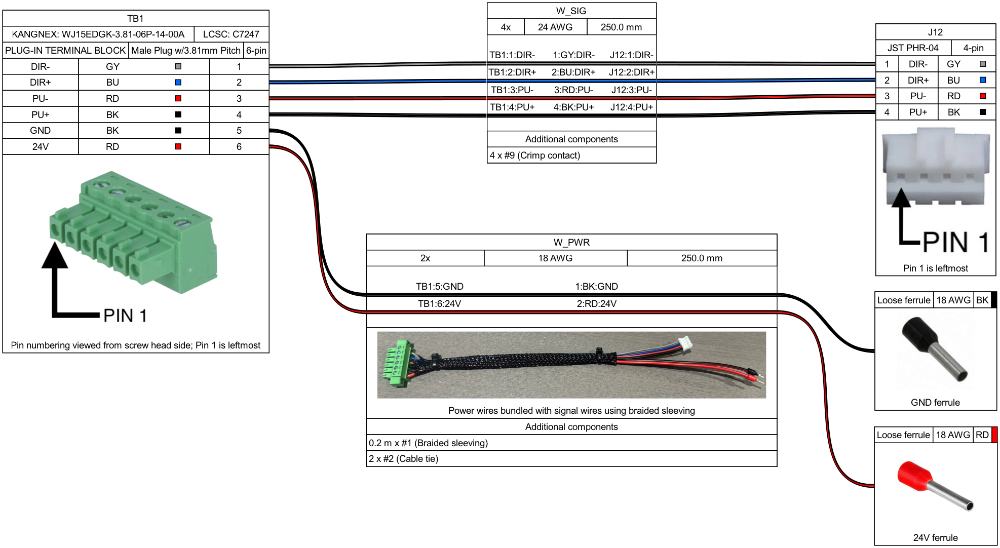

# OSSM motor control harness

[Harness YAML](OSSM-Motor-Control-Harness.yml) · [Installed harness](images/OSSM_Harness_Installed.png) · [Download PDF and cable BOM](https://github.com/researchanddesire/OSSM/actions/workflows/render-cables.yml)

## WireViz

[WireViz](https://github.com/wireviz/WireViz) turns YAML harness definitions into
wiring diagrams and a detailed cable BOM. See the [WireViz tutorial](https://github.com/wireviz/WireViz/blob/master/tutorial/readme.md) to edit or create a harness.

CI refreshes the diagram when the harness changes. To render locally, install
Graphviz and `requirements-cables.txt`, then run `bash scripts/render-cables.sh`
from the repository root. Exports are written to `cable-export/`.
